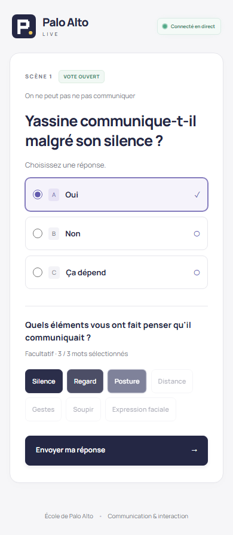
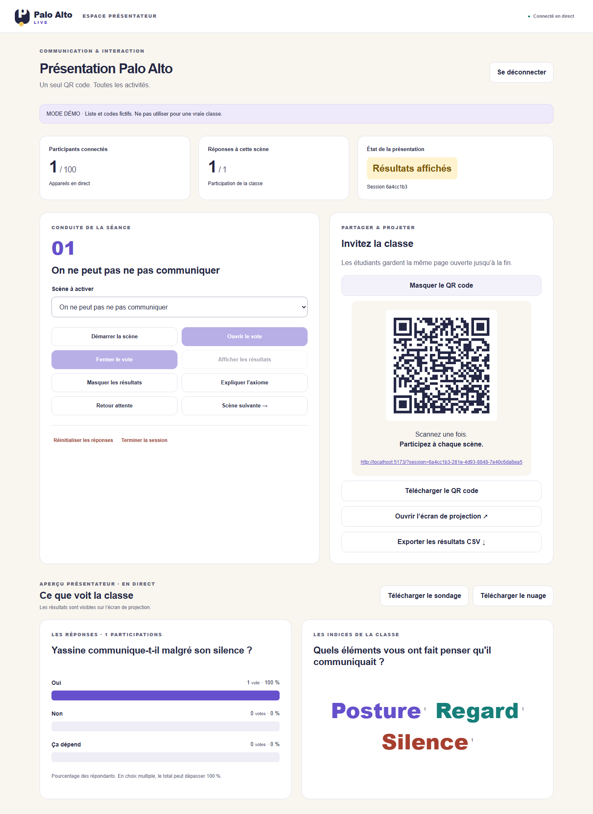
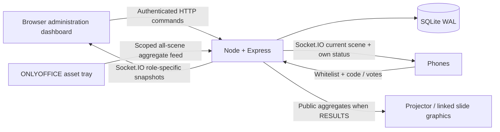

# Palo Alto Live

An audience interaction system for **ONLYOFFICE Desktop Editors Presentation Editor**. Students scan one QR code, sign in once with their Moroccan mobile number and shared presentation code, and stay on the same page through every scene. The website controls sessions, scenes, voting and publication. The editor plugin is a read-only asset tray: add transparent poll/word graphics and a QR, then drag and resize them on your own slides. Live votes refresh linked graphics while the plugin is open and connected.

Built for an academic presentation with restrained Memphis geometry, French mobile screens, accessible controls, and readable projector results. Scenes are configurable; the included two Palo Alto scenes are examples, not a five-scene constraint.

The interface uses free MIT-licensed Unlumen Button, Tabs, Highlight, Glowing Badge, Copy and Count Up primitives, the exact plugin icon, and self-hosted Manrope typography. See [UI design and licensing](docs/UI_DESIGN.md). For hosting off the laptop within free/trial allowances, [Railway is the selected provider](docs/RAILWAY.md).

## Use the hosted platform

No local server is required. Open [the presenter dashboard](https://paloalto-live-production.up.railway.app/presenter), choose **Créer une présentation**, and save your organizer email and generated presentation code.

1. **Scènes & questions**: create/reorder scenes, write poll choices and word prompts, choose the countdown and save. Preparation stays on Railway until presentation day.
2. **Votants**: enter names and phone numbers directly in the table. No CSV or individual student codes are needed for new presentations.
3. **Présenter**: share the QR and presentation code. Open voting after each scene; the countdown closes voting and publishes results. Advance to the next scene when ready.

Return using your organizer email and presentation code. Voters use their allowed phone number and that code. The organizer email is an identifier, not an email-verification or delivery service; keep it private because it accompanies the shared code for administrative login. Questions lock when the presentation starts. The ONLYOFFICE plugin signs in with the same organizer email + code and lets you place graphics for every saved scene before launching votes. In **Présenter**, use **Réinitialiser cette scène** for a single retry, or **Effacer les essais et revenir au début** before the real launch. The full reset clears votes, returns to scene one and unlocks preparation while retaining code and voters; confirmation is required.

## Quick start — isolated local demo

Requires **Node.js 24+**, npm, and a modern browser. ONLYOFFICE 9.3+ is required for linked graphics. 9.3.1.8 is installed in this environment; native insertion/refresh requires rehearsal.

```powershell
cd codingprojects/paloalto-live
npm install
npm run demo
```

- Participant: <http://localhost:5173> — phone `0610000001`, code `demo1234`.
- Presenter: <http://localhost:5173/presenter> — create an email/code presentation with the normal workflow. Legacy fixture controls remain at `/presenter?legacy=1` with key `demo-presenter` for regression testing.
- Demo automatically creates a session and 100 fictitious eligible students (`0610000001` through `0610000100`). These are synthetic fixtures, not verified unassigned telephone numbers. No SMS is sent.
- Run `npm run simulate -- --participants 30` in another terminal. This connects clients, casts votes and words, closes voting, and shows results. It refuses production servers.
- `Ctrl+C` stops development services. Demo uses `data/demo.sqlite`; production credentials and database settings are overridden for the demo.

## Features

Persistent SQLite sessions; Socket.IO updates with fresh reconnect snapshots; server-side authorization; hashed phones and personal codes; one vote per participant per scene; idempotent network retries; configurable single/multiple-choice polls; bounded predefined or custom words; frequency-sized word cloud; counters; confirmed resets; anonymous CSV export; QR generation; transparent PNG assets or full 1600×900 result exports; additive linked slide graphics with automatic picture updates; a public aggregate projector screen.




## Architecture



The production backend serves the compiled web app on the same origin. No Supabase account, Firebase project, Vercel account, SMS provider, or cloud secret is needed. The free classroom option is a laptop on the class LAN. Hosted deployments need a long-running Node instance with persistent disk; see deployment documentation.

## Real class setup

```powershell
Copy-Item .env.example .env
# Generate two different values and put them in ADMIN_KEY and PHONE_HASH_SECRET:
node -e "console.log(require('crypto').randomBytes(32).toString('hex'))"
# Edit PUBLIC_URL and ALLOWED_ORIGINS for your actual address.
npm run import:class -- shared/sample-class.csv data/access-codes.private.csv
npm run dev
```

Import your **own** CSV (`phone,name`, with optional `pin`) before the class. Generated individual codes must be distributed privately; the system does not send messages. Names are optional and never included in audience output. The private output CSV contains phone numbers and codes: keep it outside Git and delete it when no longer needed. Import warnings include row numbers, not phone numbers.

In development, backend is port 3000 and the Vite web app port 5173. `npm run dev` runs both. For backend only: `npx tsx watch backend/src/index.ts`; frontend only: `npx vite --host 0.0.0.0`. For production:

```powershell
npm run build
npm start
```

Set `PUBLIC_URL=http://YOUR-LAN-IP:3000` for a production build on a LAN, or an HTTPS domain for public deployment. `localhost` in a QR code points to the student's phone, not your laptop. Use HTTPS for real-class credentials whenever possible.

## ONLYOFFICE installation

```powershell
npm run build
npm run package:plugin
```

1. Open a presentation in ONLYOFFICE Desktop Editors.
2. Choose **Plugins → Plugin Manager → My plugins → Install plugin manually**.
3. Select `dist/paloalto-live.plugin`.
4. Choose **Plugins → Palo Alto Live**. Sign in with the same organizer email + presentation code. Railway is the default server; local tests can expand **Adresse du serveur**.
5. Choose any saved **Scène à placer** in the plugin. Select a slide in edit mode, add its poll, word cloud or QR, then drag/resize the selected graphic with native ONLYOFFICE handles.
6. Keep the plugin open and connected. Live votes and resets update every scene's linked graphics without changing geometry. Keep them ungrouped and their object names intact. New bindings include the presentation ID. Downloaded PNGs remain snapshots; recreate old QR assets once.

This workspace's plugin was also installed through the official per-user plugin folder for local validation. The `.plugin` archive contains `config.json` at its root and bundles the SDK locally for use without a CDN.

## Validation and build

```powershell
npm test
npm run lint
npm run typecheck
npm run build
npm run package:plugin
npm run verify:production
npx playwright install chromium
npm run test:e2e
npm run format:check
```

Browser tests use the isolated demo and change its session data. The simulator also resets the current demo scene. Current evidence and manual editor coverage are recorded in [VALIDATION.md](docs/VALIDATION.md).

After staging or committing source, run `npm run package:release` to create `dist/paloalto-live-project.zip` with tracked source and selected production builds. It excludes databases, private codes, `.env`, installed dependencies and test traces. Local Git history remains in this workspace; the ZIP is a portable source delivery.

## Project layout

```text
backend/             Express routes, auth, SQLite store, migration
participant-app/     React mobile, presenter and projector screens
onlyoffice-plugin/   Manifest, SDK bridge, bundled SDK and package inputs
shared/              Configuration, scene schema, state machine, phone rules
scripts/             Demo, simulator, CSV import, build, package and purge
tests/               Model/backend tests and Playwright classroom flow
docs/                Runbooks, architecture, research and screenshots
dist/                Generated production web/backend and .plugin archive
data/                Private local databases and codes (ignored)
```

## Documentation

| Document                                       | Purpose                                       |
| ---------------------------------------------- | --------------------------------------------- |
| [Installation](docs/INSTALLATION.md)           | Requirements and first setup                  |
| [Architecture](docs/ARCHITECTURE.md)           | Components, state and synchronization         |
| [ONLYOFFICE plugin](docs/ONLYOFFICE_PLUGIN.md) | APIs, packaging, installation and limits      |
| [Backend setup](docs/BACKEND_SETUP.md)         | Environment variables and CSV import          |
| [Deployment](docs/DEPLOYMENT.md)               | LAN, Docker, HTTPS and hosted options         |
| [Database](docs/DATABASE.md)                   | Tables, constraints and migration             |
| [Security](docs/SECURITY.md)                   | Permissions, authentication and threat model  |
| [Privacy](docs/PRIVACY.md)                     | Stored data, retention and deletion           |
| [Participant guide](docs/USER_GUIDE.md)        | Student instructions in French                |
| [Presenter guide](docs/PRESENTER_GUIDE.md)     | Nontechnical classroom runbook in French      |
| [Development](docs/DEVELOPMENT.md)             | Commands, scene editing and tests             |
| [Troubleshooting](docs/TROUBLESHOOTING.md)     | Practical fixes                               |
| [Design decisions](docs/DESIGN_DECISIONS.md)   | Alternatives, tradeoffs and official research |
| [Validation](docs/VALIDATION.md)               | Results and remaining manual checks           |
| [Railway deployment](docs/RAILWAY.md)          | Selected Trial/Free hosting and setup         |
| [UI design](docs/UI_DESIGN.md)                 | Free UI resources, tokens and accessibility   |

Source is provided under AGPL-3.0; the unmodified ONLYOFFICE SDK retains its copyright header and additional license terms. See `LICENSE` and [third-party notices](docs/THIRD_PARTY.md). No real credentials are included.
