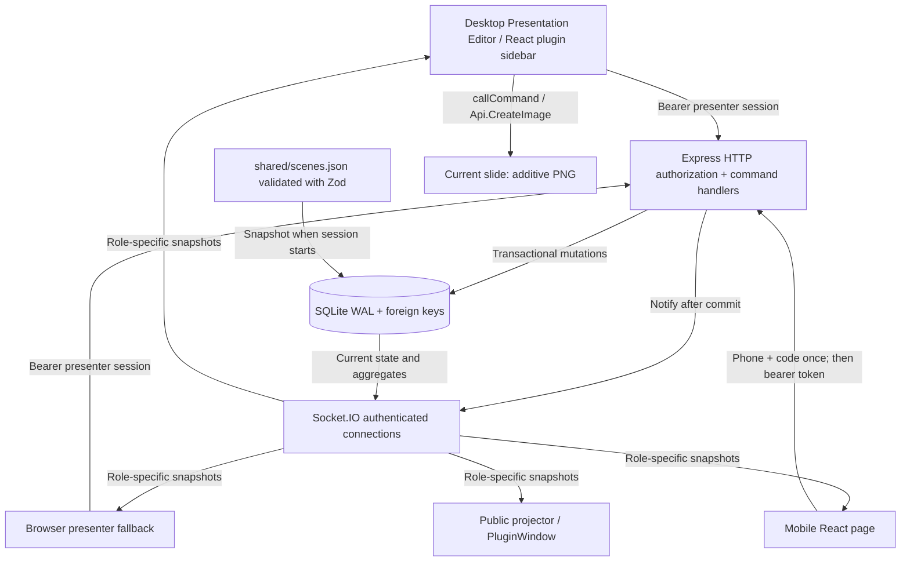
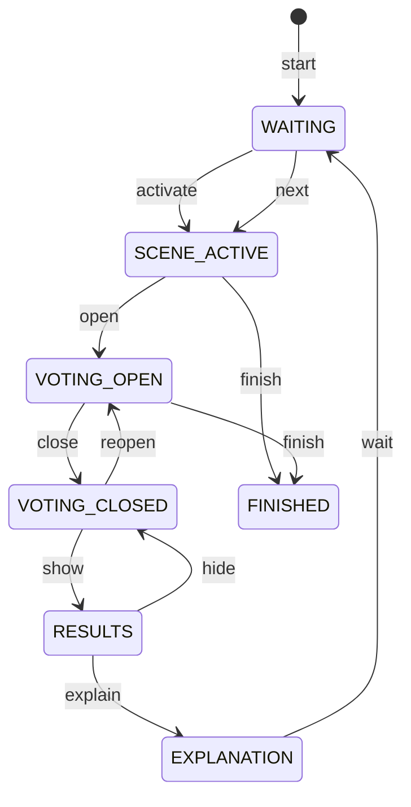

# Architecture

## Component responsibilities

`backend/src/store.ts` owns database invariants, authorization, state transitions, aggregation and anonymous export. `app.ts` authenticates HTTP and Socket.IO, validates payloads, rate limits operations and projects snapshots separately per role. No browser accesses the database directly.

React screens in `participant-app` share `useLive`, components, design tokens and the presenter view with the plugin. The editor bridge only adds current-slide insertion and official `PluginWindow` calls. A teammate can use `/presenter` while the main speaker runs the slideshow. `/display?session=...` needs no admin token and receives only publishable aggregates.

The root npm package manages dependencies for four small workspaces. Vite builds the web application; esbuild bundles the backend and two plugin entries. The plugin has no remote JS/CDN dependency. Backend dependencies remain external in the Node bundle and are installed by `npm ci`.

## State machine

`shared/model.ts` defines the complete allowed action matrix; the diagram illustrates the normal route. Switching scenes or returning to waiting during an open vote is rejected; close first. Reset is a confirmed exception that clears only current-scene responses, increments its epoch, and returns to SCENE_ACTIVE. Finishing from any active mode closes the session. New sessions have new public UUIDs and new participant authentication.

## Concurrency and delivery

SQLite `BEGIN IMMEDIATE` serializes command and vote checks with their writes. Commands carry the expected state version; two presenters cannot silently overwrite each other's state. The response primary key permits one participant response per session, scene and epoch. A repeated request UUID returns a successful acknowledgement even after voting closes, but a different UUID for the same poll is rejected.

The server emits a full state after each commit, on connect, and every 15 seconds. Clients reconcile over HTTP every 10 seconds and on becoming visible. The server never assumes missed Socket.IO events will be replayed. Participant snapshots include only their submitted flag, not anyone's response row or identity. Counts derive from distinct participant IDs among active sockets, not historical logins; a disconnect may take the socket heartbeat timeout to detect.

The phone persists one queued submission until HTTP acknowledgement. It retries at reconnect and every four seconds; the server's scene ID and epoch checks prevent an old queued vote entering a new round. Votes must arrive while voting is open. A queued vote that was never saved before closing is rejected with an understandable message.

## Operating envelope

One Node process, one class list, one active presentation. SQLite and socket presence are local to that process. Do not run multiple replicas behind a load balancer. 30 simultaneous participants were tested; this is not a benchmark for thousands. HTTP polling remains functional without a socket, but the connected count and presenter control availability require a working real-time connection. No video playback synchronization, slide-to-scene mapping or cloud failover is claimed.
